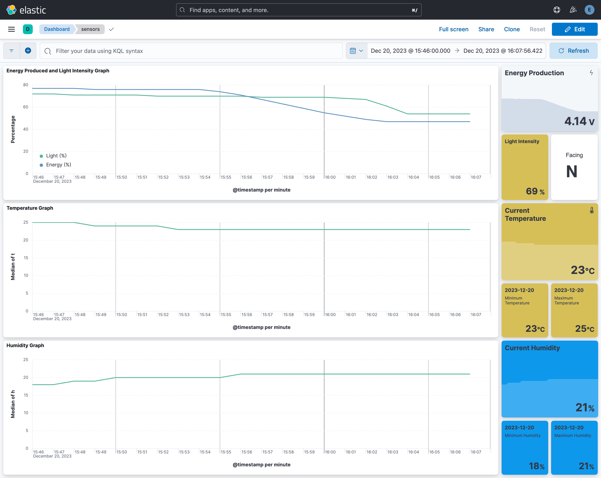

# IoT Solar Station

*Edge Computing in the IoT* project made by Alfio Vavassori, Cristiano Colangelo, Samuel Corecco, and Edoardo Riggio.


## Info about the Project

### Abstract

The IoT Solar Station is an advanced weather station with an integrated self-positioning solar panel.
The orthogonal 2-axis servo motors move the solar panel,
while the attached voltmeter constantly measures the current power production.
The solar panel moves at different angles and searches for the best one based on the voltmeter measurements.
The onboard sensors send the collected data to a private MQTT broker, which forwards the data to a Python backend.
The backend ingests the data into a DigitalOcean cloud instance hosting an ElasticSearch database via Docker containers.
Finally, a Kibana dashboard deployed alongside the database showcases the collected data in nice,
compact visualizations.

### Hardware

The following is a list of components used in this project:

- (1x) Arduino Portenta H7
- (1x) Small Solar Panel
- (1x) M5-ADS1115 Voltmeter
- (1x) BME280 Ambient Sensor
- (1x) BH1750FVI-TR Ambient Light Sensor
- (1x) PCA9685 Servo Driver Shield
- (1x) Female DC Power Plug
- (2x) MG996R High Torque Servos
- (33x) Jumper Wires

Schematics of the system can be found in the `assets/ckt/project-circuit.ckt` [cirkit](https://www.cirkitdesigner.com/) file.


### Cloud Architecture

For our project, we decided to implement communication with an MQTT (MQ Telemetry Transport) broker,
which allows us to send lightweight, continuous messages to our cloud instance.
We used the service shiftr.io, a high-performance broker that easily connects devices to the same network.
To implement communication, we used a MQTT client library in both the Arduino Portenta and our Python backend.
The MQTT client on the Arduino board will send a message after every calibration phase.
The client emits a JSON message on a defined topic, and the Python backend will subscribe to that topic.
When a message is sent from the Arduino,
the Python server will receive the message which will then be sent to our ElasticSearch service,
and finally displayed in the Kibana dashboard.



The following are the cloud components used:

- Shitfr.io (MQTT Broker)
- DigitalOcean Droplet (MQTT Server)
- Python Server (MQTT Listener)
- ElasticSearch+Kibana (Database and Dashboard)


## How to Run

### Arduino Script

First of all, copy the `arduino/config.template.h` and paste it in `arduino/` as `config.h`.
After, fill in the file with your personal WiFi SSID and MQTT Server IP.
Open the Arduino `.ino` file using the Arduino IDE.
Then, download all necessary libraries:

- MQTT (by Joel Gaehwiler)
- BH1750 (by Christopher Laws)
- ADS1115_WE (by Wolfgang Ewald)
- ArduinoJson (by Benoit Blanchon)
- Adafruit PWM Servo Driver Library (by Adafruit)
- DFRobot_BME280 (by DFRobot)

Finally, using the Arduino IDE, compile and load the script.

### Python Server

Before running the server, copy `config.template.ini` and paste it as `config.ini`.
After filling in the file, use the following command to create a conda environment with the required libraries.

```shell
conda env create -f environment.yml
```

With the new conda environment, just run the `server.py` file.

### Dockerfile

For your convenience, we also  uploaded the Dockerfile we used in our server.
In particular, this container will perform all the actions listed in the `Python Server` section.
